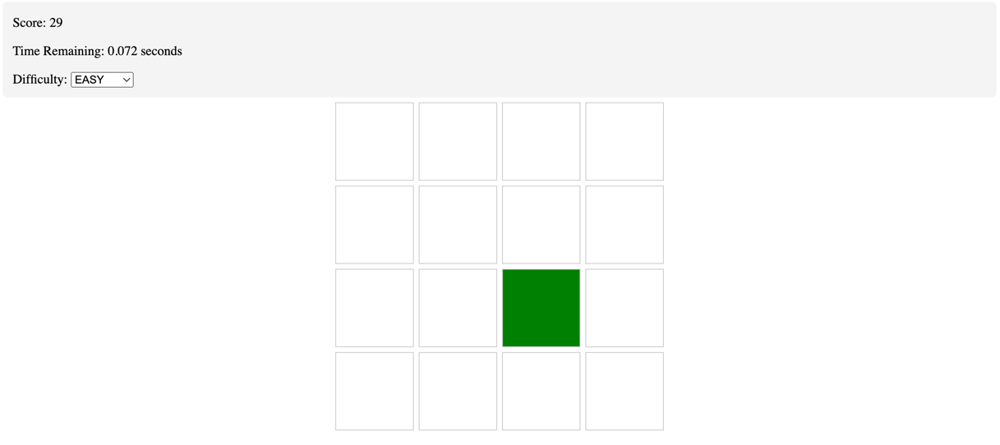

# Jest and TypeScript




This is a simple game using TypeScript and Jest to demonstrate using Coverage Robot in a
Frontend focussed project.

The rules are simple:

1. The currently active tile is shown in green
2. Press the active tile before the time runs out to increase your score
3. If you miss the time, your score wont increase!

## Local Development

```bash
npm install
npm run dev
```

## Automation Tests

```bash
npm install
npm run test:coverage
```
